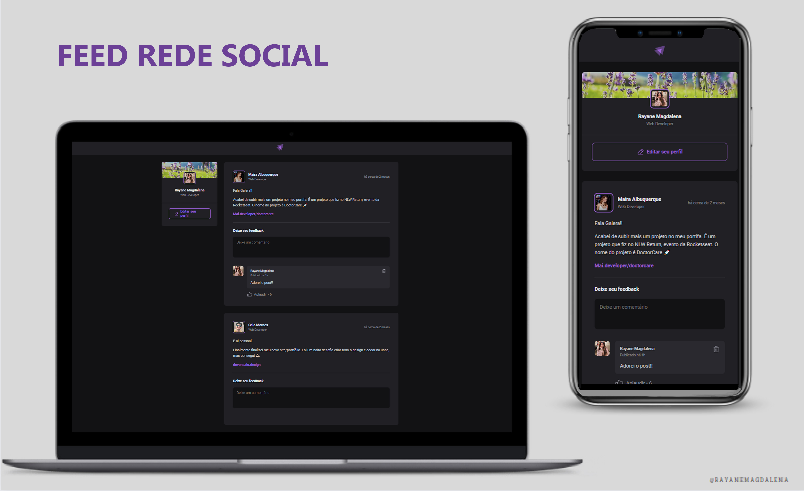

<h1 align="center"> Feed Rede Social </h1>

&nbsp;&nbsp;&nbsp;|&nbsp;&nbsp;&nbsp; <a href="#sobre">Sobre</a> &nbsp;&nbsp;&nbsp;|&nbsp;&nbsp;&nbsp;
<a href="#tecnologias-utilizadas">Tecnologias Utilizadas</a> &nbsp;&nbsp;&nbsp;|&nbsp;&nbsp;&nbsp;
 

 

  

<h4 align="center"> 
	 Status: Finalizado
</h4>

## Sobre
 

Trata-se de uma aplicação que simula um Feed de rede social, onde é possível adicionar e remover comentários e aplaudir os posts (like).
A aplicação foi desenvolvida em React durante a trilha de ReactJS da [@rockeatseat](https://www.rocketseat.com.br/). 

- [Acesse o projeto em execução aqui!](https://rayanemagdalena.github.io/redeSocial/)

 

## Tecnologias Utilizadas
 

-   React

-  GIT

-  GitHub

-  Figma
 
 

- [Date-fns](https://date-fns.org/)  
- [Phosphor icons](https://phosphoricons.com/)
- CSS Modules
 
 

---			
 

  

